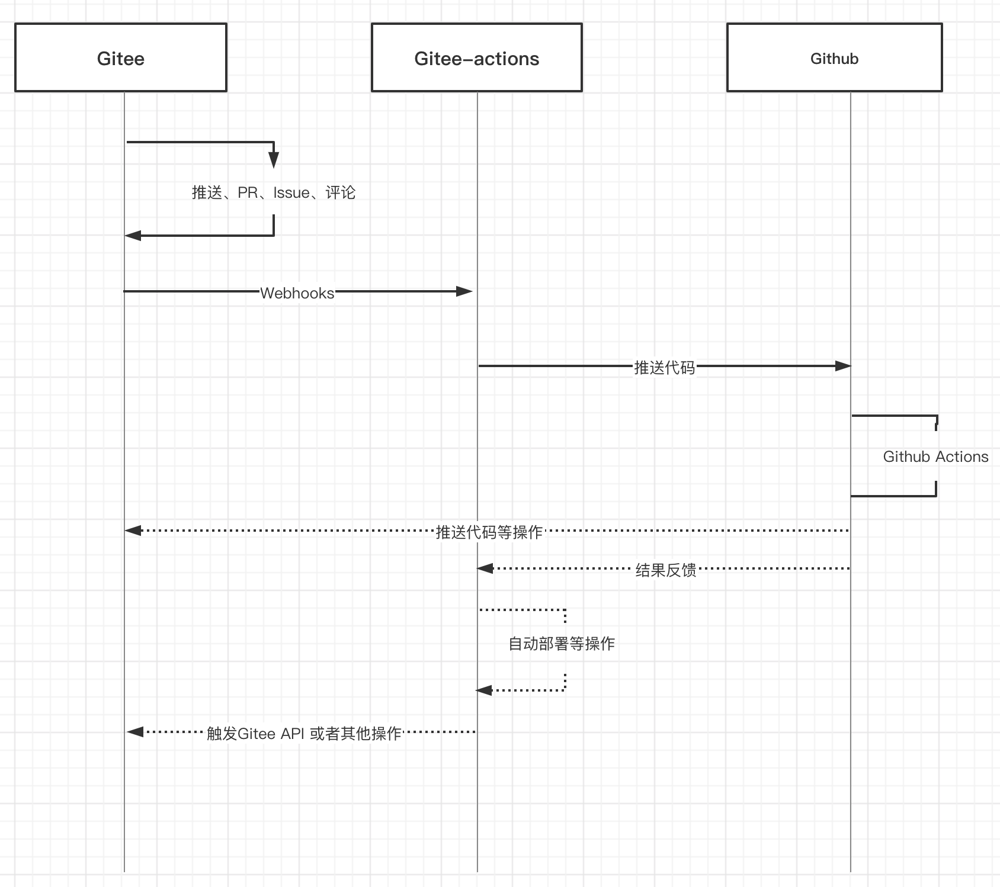

# Gitee-Actions

利用 Gitee Webhooks 钩子调用当前服务器中的接口，推送代码到 Github 上触发 Push 类型状态的 Git Actions。

## 流程



## 功能列表

-   [x] Pull Request 类型钩子
-   [ ] Issue 类型钩子
-   [ ] Comment 类型钩子
-   [ ] Push 类型钩子

## 准备

-   Gitee 的 SSH 公钥
-   Github 的 SSH 公钥
-   一台可以连接到 Github 的服务器(访问慢可以使用 Fastgithub 代理加速)
-   Github Actions 配置

## 直接使用

1. 克隆代码
2. 运行服务器
3. 添加配置项
4. 配置 webhooks 触发服务器中对应的接口
5. 成功

## Nest 集成

### 安装依赖

```bash
$> npm install gitee-actions
```

### 注册模块

```ts
import { GiteeActionsModule } from 'gitee-actions';
@Module({
    imports: [GiteeActionsModule.register(/* Options */)],
})
class AppModule {}
```

## API

### Gitee Actions Module

#### WorkspaceService

```ts
declare class WorkspaceService {
    /**
     * 建立临时工作区
     *
     * @param type 触发流程的类型
     * @param dirName 文件夹名称
     */
    setup(type: WorkflowTriggerType, dirName: string): Promise<void>;

    /**
     * 清理临时工作区
     *
     * @param type 触发流程的类型
     * @param dirName 文件夹名称
     */
    cleanup(type: WorkflowTriggerType, dirName: string): Promise<void>;

    /**
     * 获取临时工作区绝对路径
     *
     * @param type 触发流程的类型
     * @param dirName 文件夹名称
     */
    getFolderAbsolutePath(type: WorkflowTriggerType, dirName: string): string;

    /**
     * 获取处理后的路径
     *
     * @param type 触发流程的类型
     * @param dirName 文件夹名称
     */
    getNormalizedPath(...paths: string[]): string;
}
```

#### WorkflowService

```ts
declare class WorkflowService {
    /**
     * 运行工作流
     *
     * 拉取并推送代码
     *
     * @param type 触发流程的类型
     * @param options 配置项
     */
    run(type: WorkflowTriggerType, options: RunnerOptions): Promise<void>;
    /**
     * 检出代码
     *
     * @param origin 需要检出的仓库路径
     * @param branch 需要检出的分支
     * @param dirPath 检出到的文件夹路径（可选）
     */
    checkout(origin: string, branch: string, dirPath?: string): Promise<void>;

    /**
     * 推送代码
     *
     * @param dirPath 文件夹路径
     * @param origin 源代码仓库路径
     * @param sourceBranch 源代码分支
     * @param targetBranch 需要推送到远端的分支 默认是与原分支一致
     */
    push(dirPath: string, origin: string, sourceBranch: string, targetBranch?: string): Promise<unknown>;
}
```

### Gitee Module

#### GiteePullRequestService

```ts
declare class PullRequestService {
    private readonly config;
    private readonly httpService;
    /**
     * 评论 Pull Request
     * @param remote 仓库地址
     * @param number PR的序号
     * @param message 评论的信息
     */
    comment(
        remote: string,
        number: number,
        message: string
    ): Promise<{
        message: string;
    }>;

    /**
     * 获取 Pull Request详情
     * @param remote 仓库地址
     * @param pullRequestId Pull Request Id
     * @param branch 分支名称
     */
    getDetail(remote: string, pullRequestId: string, branch?: string): Promise<any>;

    /**
     * 获取 Pull Request列表
     * @param remote 仓库地址
     * @param params 查询参数
     */
    getList(
        remote: string,
        params?: {
            head?: string;
            state?: 'open' | 'closed' | 'merged' | 'all';
        }
    ): Promise<{
        message: string;
        data: any;
    }>;
}
```

## 许可证

[MIT](./LICENSE)
