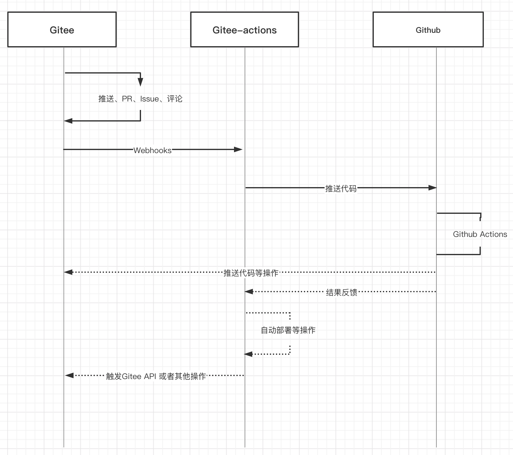

## 配置

### 配置 Gitee Webhooks

在 `Gitee` 的仓库中配置 `Webhooks`。

配置好所需要触发工作流的 `Webhooks`。

### 配置 Github Actions

通过`Push`操作，可以触发`Github Actions`中的`Push`钩子，所以需要配置好`Push`操作所触发的`Github Actions`配置文件

## 触发

通过`Pull Request`，`Push`，`Issue`，`Comment`等操作触发 `Webhooks`

## 运行

`Webhooks` 触发服务的工作流后，会生成一个临时工作区。

在临时工作区执行对应的工作流，推送代码到指定的仓库内。

在工作流中，会注入一些环境变量到`.github/workflow`中所有的`yaml`文件中。

工作流执行完，临时工作区会被清理。

## Github Actions

触发工作流后，可以进行一系列的自定义操作。

-   通过 `Gitee Open API` 进行 `Gitee` 仓库的评论回调
-   把构建好的文件部署到对应的服务器中
-   把构建好的文件部署到其他分支中
-   广播通知
-   ...
